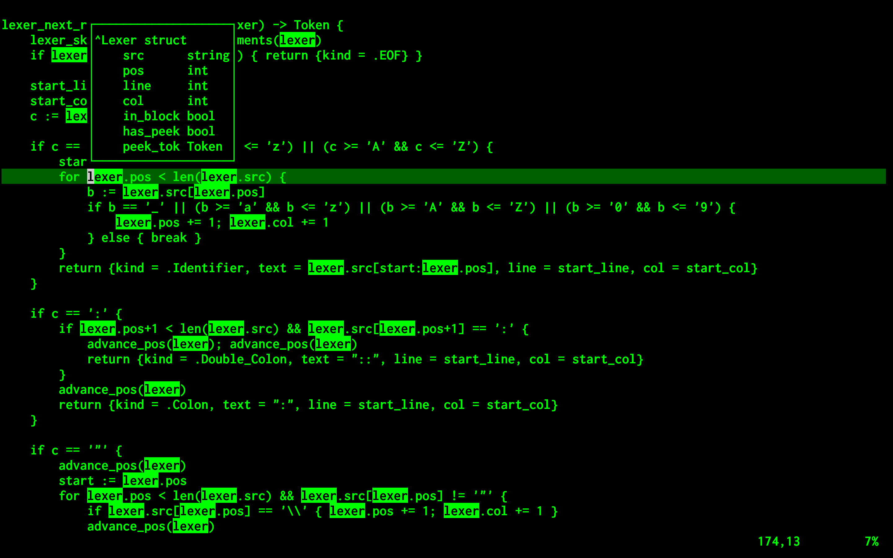
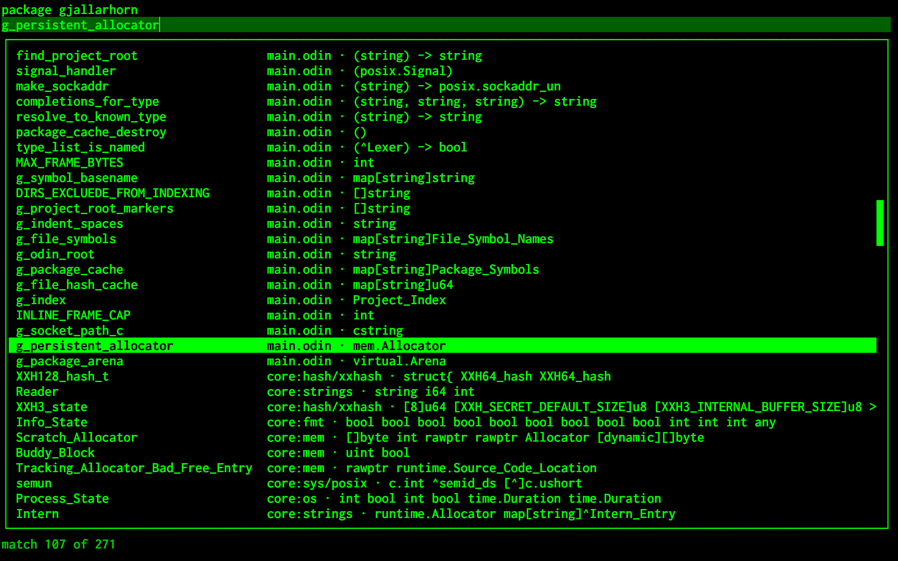

# Gjallarhorn

A lightweight Vim plugin for Odin: autocomplete, hover, and go to definition.
It stays out of your way until you need it.




If you want an IDE experience with refactoring, diagnostics, code actions, and LSP support across many editors, [OLS](https://github.com/DanielGavin/ols) is the right choice.

Why use Gjallarhorn then?

- **Speed** — A custom lexer made in odin over a binary Unix socket. Purpose-built for completion and definitions with no AST or JSON overhead. Vim9 script that compiles into bytecode.
- **Focus** — No diagnostics, no squiggly underlines, no editor trying to fix your code while you're still writing it. The compiler is the source of truth.
- **Simplicity** — Clone, run the install script, open Vim. No dependencies, no package manager.

## Requirements

- [Odin](https://odin-lang.org) compiler to build
- POSIX system (macOS, Linux, BSD, etc)
- [Vim](https://github.com/vim/vim) 9.0+

## Install

Clone the repository:
```sh
git clone https://github.com/Solver42/gjallarhorn ~/.vim/pack/plugins/start/gjallarhorn
```

Compile the `gjallarhorn` binary and install it under `~/.local/bin`:
```sh
sh ~/.vim/pack/plugins/start/gjallarhorn/install.sh
```

## Update

```sh
cd ~/.vim/pack/plugins/start/gjallarhorn && git pull && sh install.sh
```

## Usage

- **Ctrl+X Ctrl+O** triggers autocomplete suggestions for structs, enums, unions, type aliases, local variables, imported libraries, and chained member access (a.b.c).
- **K** toggles a popup displaying detailed information about the symbol under the cursor, including enum values, union types, struct fields, constant values, and procedure signatures (parameters and return types).
- **gd** jumps to the symbol's declaration, even if the file is not currently open in Vim.

## How it works

It indexes your project on startup and stays up to date as you edit. When you open a .odin file, Gjallarhorn walks up the directory tree to find a project root — the first directory containing a marker file (.git, .editorconfig, or gjallar.horn). A simple way to mark a root explicitly is:

```sh
touch gjallar.horn
```

## Configuration

If you want the binary in a custom path you need to point to it with `g:gjallarhorn_bin` in your `.vimrc`:

```vim
let g:gjallarhorn_bin = expand('~/.local/bin/gjallarhorn')
```

You can change which files/directories mark a project root, by setting `g:gjallarhorn_root_markers` in `.vimrc`:

```vim
let g:gjallarhorn_root_markers = ['.git', 'main.odin']
```

For easier autocomplete access, remap Ctrl+Space in `.vimrc`:

```vim
inoremap <silent> <NUL> <C-x><C-o>
```
or
```vim
inoremap <silent> <C-Space> <C-x><C-o>
```

## License

[MIT](LICENSE)
